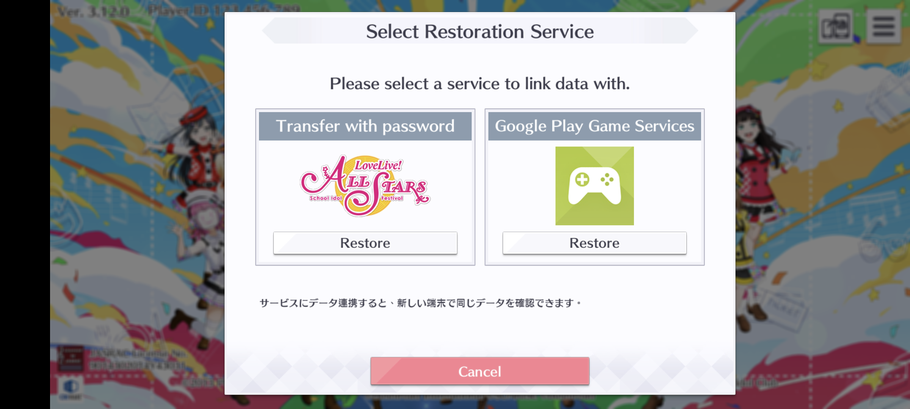
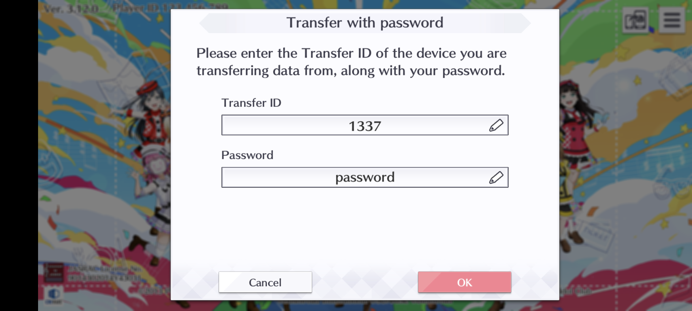
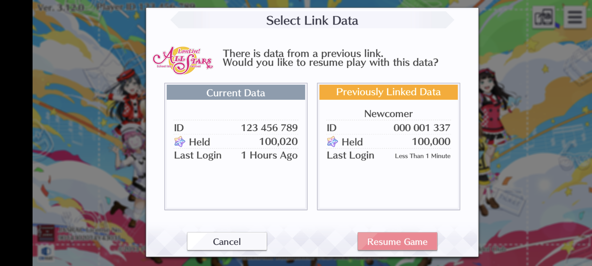
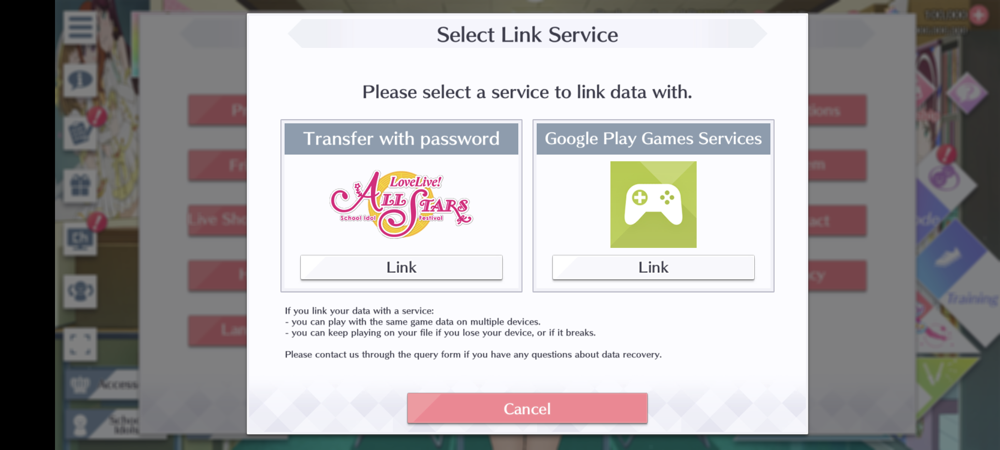
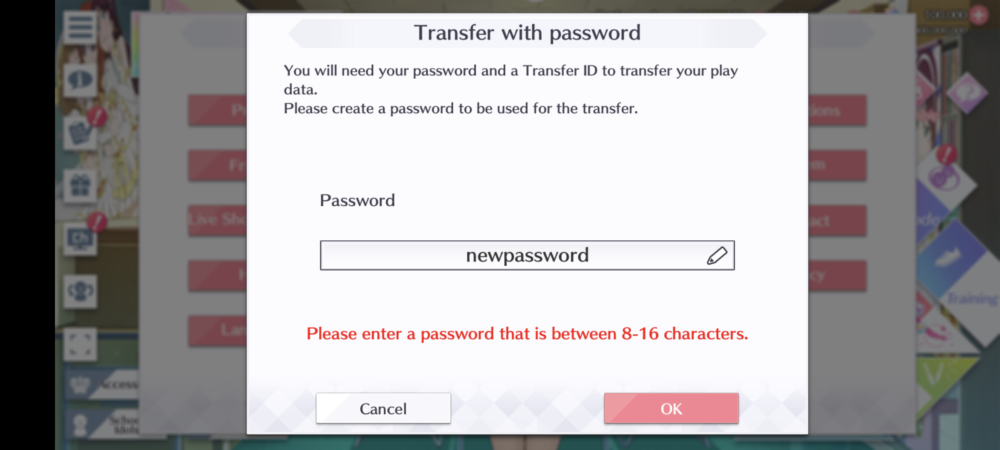
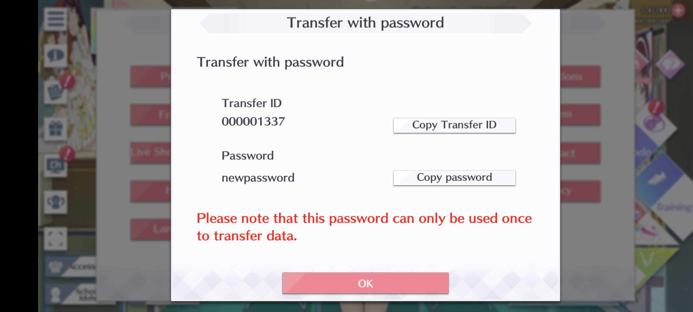

# elichika
A fork of https://github.com/YumeMichi/elichika, check out the original.

## Installing
Note that this part concern only this server implementation, and it only provide the easiest way to do things.

You should check out checkout the [LL hax wiki](https://carette.codeberg.page/ll-hax-docs/sifas/) for clarification and general knowledge, as it explain things better (or it can lead you to places where you can ask questions).

### Android
To install the server, first install termux, you can get it from [f-droid](https://f-droid.org/en/packages/com.termux/) or [github](https://github.com/termux/termux-app#github). Note that the google play store version will most likely NOT WORK.

Then run the install script inside termux, this will take care of everything:
```
curl -L https://raw.githubusercontent.com/arina999999997/elichika/master/bin/install.sh | bash
```

To run a command, copy (or type) it and hit the enter button.
### PC (Windows, Linux, MacOS)
You can setup the server in a desktop machine to play on android or ios.

#### Setup manually
Install git and go, and then use the same install script with termux (on Windows, run inside git bash or some other linux shell emulator):

```
curl -L https://raw.githubusercontent.com/arina999999997/elichika/master/bin/install.sh | bash
```

This will leave some trashes, so you can clone the respository and build manually, look at the scripts for the necessary steps.

#### Using Docker
A [docker compose](./docker/docker-compose.yml) is provided with this repository for creating a container. More information on deploying with docker can be found [here](./docs/docker.md).

Assuming you're familiar with docker, this can be a faster way of getting things working. Keep in mind that using docker, some of the step below will not apply, you should reference the docker docs instead.

Thanks to [yunimoo](https://github.com/yunimoo) for preparing docker files.

## Running the server
After installing, you need to run the server to play using the following command:

```
~/run_elichika
```

If you have GUI for Windows/Linux, you can also just run the executable directly.

Note that whenever you want to play, the server need to be on, so if you already closed termux or the server, you will have to run it again.

## Updating the server
You can update the server by running:

```
~/update_elichika
```

As of current version, you should be able to keep your progress while doing this, so it's recommended to do it often so you get access to newly implemented features.

It is also a good idea to backup ``userdata.db`` or to export your data (with the WebUI) before doing this, as updating from a too old version might result in breaking changes.

## Playing the game
With the server running, and the client network setup correctly, simply open the game and play.

The first time you login, you will be given a random user id. If you wish to, you can use the transfer account to obtain a specific user id.

### Multi accounts / Account transfer
You can use the account transfer system to switch / create account. Select ``transfer with password``. 


Enter your user / player id and a password:

- UserId is an non-negative integer with at most 9 digits.
- If user is in the database, password will be checked against the stored password.
- Otherwise a new account with that player id and password.
    - You can also leave the password empty.
    - If you are not running the server yourself, it's highly recommended that you setup a password, because other user can take over your account if they know your user id.
    - Passwords are securely stored with bcrypt.



After that, confirm the transfer and you can login with the new user id.



At any point, you can use the transfer id system inside the game to change your password.





### Client version
You can use both the Japanese and Global client for the same server (and the same database).

However, it's recommended to not play one account (user id) in both Japanese and Global client, because some contents are exclusive to only 1 server, and will cause the client to freeze.

### Multi devices
You can use multiple devices to play the game from one server, if you have set things up correctly.

Playing the game on another device while the current one is running will cause the current one to disconnect, preventing any error being done to your user data.

## WebUI
The WebUI allow you to interact with the server in a more direct way, both to change the server and to change your player data.

To use the WebUI, navigate to the relevant address using a web browser.

### Admin
The admin WebUI is used to change the server's behaviors.

It can be found at: `<server_address>/webui/admin`, which default to http://127.0.0.1:8080/webui/admin

To use the admin webui, you will need the admin password, but it is empty by default.

Currently, it only has the config editor, but in the future it can include things like starting/ending event and such.

Detailed explanations of some config options:

- Server's address:

    - The address to host the server at.
    - Default to ``0.0.0.0:8080`` (server listen at port 8080 on all interfaces).

- CDN server's address:

    - The server for clients to download assets.
    - Default to  https://llsifas.catfolk.party/static/ (special thanks to sarah for hosting it).
    - `elichika` also has the ability to host the CDN itself:

        - To do this, put the relevant files in `elichika/static`.
        - Then set the CDN server address to the STRING (no protocol) `elichika` (or `elichika_tls` if you're using HTTPS).
        - This will automatically use whatever the address the client reach `elichika` with as the CDN server.
        - Aside from that, you can also just use the address like normal.
        - You should look into this if you want to further develop the game/server, as doing so might require redownloading things a lot.
    
- Default item count:

    - The amount of items to give a player to start with.
    - Default to a generous amount, but you can set it to 0 to have a more true experience.
    - Note that you have to obtain the item in game first before you are given the "default item count" amount of that item.


### User
The user WebUI has features to help you with playing the game:

- Doing things quickly in your account, or setting up a maxed account.
- Adding resources to skip the grind.
- Import export data.

It can be located at: `<server_address>/webui/user`, which default to http://127.0.0.1:8080/webui/user

Check out the user [docs](webui/user/README.md) for more details.

Note that the user WebUI is not an account data editor, something like that might be developed later on.

## More docs
Checkout the [docs](https://github.com/arina999999997/elichika/tree/master/docs) for more details on the server and how to do more advanced stuffs.

Docs can also be found in relevant package in `.md` files. 

## Credit
Special thanks to the LL Hax community in general for:

- Archiving and hosting database / assets
- General and specific knowledges about the game

Even more special thanks for the specific individuals or groups (in no particular order):

- YumeMichi for original elichika.
- triangle for informations and scripts to encode/decode database, for patching the ios clients, and for daily theater logs.
- [SIFAStheatre](https://twitter.com/SIFAStheatre) and [Idol Story](https://twitter.com/idoldotst) for Daily theater English tranlation and for the original Japanese transcript.
- ethan for hosting various resource and hosting a public testing server.
- rayfirefirst, cppo for various cryptographic keys.
- tungnotpunk for ios client and help with network structure.
- Suyooo for the very helpful [SIFAS wiki](https://suyo.be/sifas/wiki/), for providing more accurate stage data, and for the bad word lists.
- sarah for hosting public Internet CDN.
- Caret for the LL Hax discord.
- And other people who more than deserve to be here but I can't quite recall right now.
